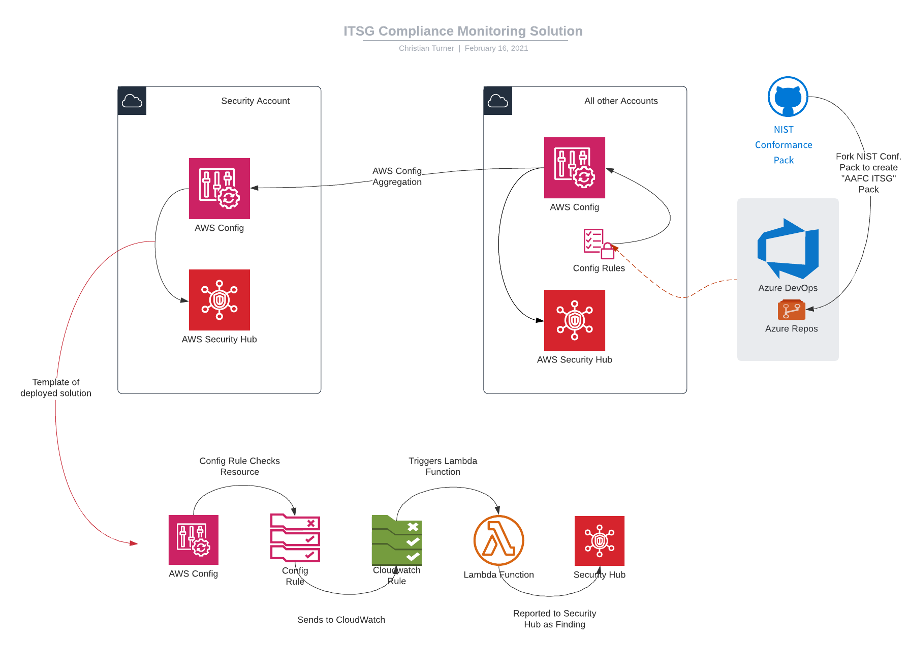
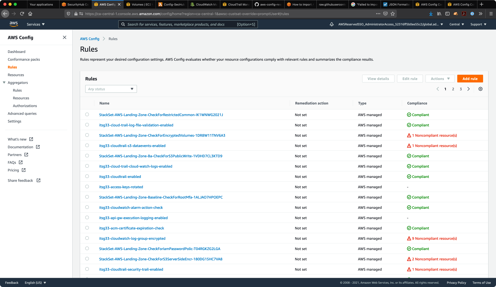

# Compliance Monitoring Solution

[TOC]

## Summary

The OCC Compliance Monitoring Solution is deployed to include the following primary services;
  + AWS Config - NIST 800-53 Rules with customized definitions
  + Security Hub
  + Parameter Store



### Components

#### Order of operations

+ CLI to configure AWS Organizations 

#### Direct API & CLI Functions

+ Create AWS Account 'Security' as Organizations Delegated Administrator 

#### IaC Templates

*Organization Root Account (MRA)*
+ AWSC Config AWS Stackset (Rules & Import Findings)

## AWS Config Rules

The AWS Config Rules are derived from the NIST 800-53 Conformance Pack.  They are deployed individually to permit us to link to an SSM Parameter Store which is tagged with the ITSG Control ID, as well integrate remediation actions as required.  ITSG rules are deployed only into the Canada region, as this is the only region in which we have deployed infrastrucutre.



### Pre-requisites

+ Authorization - Delegated Administrator:
  Authorization is not required when using **Add my organization** to select source accounts.
  - You must be signed in to the management account or a registered delegated administrator and all the features must be enabled in your organization. If the caller is a management account, AWS Config calls *EnableAwsServiceAccess* API to [enable integration](https://docs.aws.amazon.com/organizations/latest/APIReference/API_EnableAWSServiceAccess.html) between AWS Config and AWS Organizations. If the caller is a registered delegated administrator, AWS Config calls *ListDelegatedAdministrators* API to verify whether the caller is a valid delegated administrator.
  - Ensure that the management account registers delegated administrator for AWS Config service principle name (config.amazonaws.com) before the delegated administrator creates an aggregator. To register a delegated administrator, see [Register a Delegated Administrator](https://docs.aws.amazon.com/config/latest/developerguide/set-up-aggregator-cli.html#register-a-delegated-administrator-cli).

[Register a Delegated Administrator](https://docs.aws.amazon.com/config/latest/developerguide/set-up-aggregator-cli.html#register-a-delegated-administrator-cli)


## Security Hub

The Security Hub is configured to display dashboard based reports of Findings from default conformance packs.  The default packs are not utilised, with a custom template replacing them to integrate findings from the Config Rules.


### Pre-requisites

+ AWS Config:
    The service must be enabled on all accounts, with recording enabled reccommended.  This is the default status for AWS Landing Zone deployments, and no action is required
+ IAM Service Linked Role:  iam-service-linkedrole_AWSServiceRoleForSecurityHub
    This role is deployed automatically if the service has been manually deployed in the past, and therefore may be pre-exisinting.
+ Accounts and Regions:
    If you use AWS Organizations to manage accounts, the organization management account designates the Security Hub administrator account. The Security Hub administrator account must be the same in all Regions. However, the organization management account must designate the Security Hub administrator account separately in each Region. The Security Hub administrator account also manages member accounts separately for each Region.
    For member accounts created by invitation, the master-member account association is created only in the Region that the invitation is sent from. The master account must enable Security Hub in each Region that you want to use it in. The master account then invites each account to associate as a member account in that Region.
+ Coordinating master accounts across services:
    Security Hub aggregates findings from various AWS services, such as Amazon GuardDuty, Amazon Inspector, and Amazon Macie. Security Hub also allows users to pivot from a GuardDuty finding to start an investigation in Amazon Detective.
    However, the master-member relationships that you set up in these other services do not automatically apply to Security Hub. Security Hub recommends that you use the same account as the master account for all of these services. This master account should be an account that is responsible for security tools. The same account should also be the aggregator account for AWS Config.

## Security Hub Deployment

### Manual Steps - Not supported via IaC

#### Designating a Security Hub administrator account (Security Hub API, AWS CLI)

To designate the Security Hub administrator account, you can use an API call or the AWS Command Line Interface. You must use the organization management account (Master Root Account) credentials.

To designate the Security Hub administrator account (Security Hub API, AWS CLI)

**Security Hub API** – Use the *EnableOrganizationAdminAccount* operation. You must provide the AWS account ID of the Security Hub administrator account.

**AWS CLI** – At the command line, run the *enable-organization-admin-account* command.

```bash
aws securityhub enable-organization-admin-account --admin-account-id <admin account ID>
```

Example

```bash
aws securityhub enable-organization-admin-account --admin-account-id 777788889999
```

#### Removing a Security Hub administrator account (Security Hub API, AWS CLI)

To remove the Security Hub administrator account, you can use an API call or the AWS Command Line Interface. You must use the organization management account credentials.

When you use the API or AWS CLI to remove the Security Hub administrator account, it is only removed in the Region where the API call or command was issued.

To remove the Security Hub administrator account (Security Hub API, AWS CLI)

**Security Hub API** – Use the *DisableOrganizationAdminAccount* operation. You must provide the account ID of the Security Hub administrator account.

**AWS CLI** – At the command line, run the *disable-organization-admin-account* command.

```bash
aws securityhub disable-organization-admin-account --admin-account-id <admin account ID>
```
Example
```bash
aws securityhub disable-organization-admin-account --admin-account-id 777788889999
```

#### Enabling Security Hub automatically for new organization accounts (Security Hub API, AWS CLI)

To determine whether to automatically enable new organization accounts, the Security Hub administrator account can use the Security Hub API or the AWS Command Line Interface.

To automatically enable new organization accounts

**Security Hub API** – Use the UpdateOrganizationConfiguration operation. To automatically enable new organization accounts, set autoEnable to true.

**AWS CLI** – At the command line, run the update-organization-configuration command.
```bash
aws securityhub update-organization-configuration --auto-enable
```

## Config Rules Deployment

### Template Design

The Config Rules that constitute the NIST 800-53 pack have been extracted and converted into standalone rules, deployed within a single template.  The rules have a truncated copy of the *'Rule Description'* added for ease of reference.

Whilst the Config Rules have been reviewed independently by local team members, there is no current attestation to the ITSG standards, and these should be confirmed by deployment security teams.

The template is designed to be deployed as part of an AWS CloudFormation StackSet, applied to the AWS Organization.  The deployment method will ensure automated inclusion into the monitoring solution, and a single code template to manage the rules and components.

The stackset exports the Config Rule ARNs into an SSM Parameter Store, which will allow us to integrate any future IaC in an automated manner.  Within any secondary template, the rules can be referenced without knowing their specific ARN, requiring manual parameter entry or complex code conditioning using additional functions.

[Use of SSM Parameters in Cloudformation](https://docs.aws.amazon.com/AWSCloudFormation/latest/UserGuide/dynamic-references.html)
```yaml
Ec2Instance: 
  Type: AWS::EC2::Instance
  Properties: 
    ImageId: '{{resolve:ssm:/aafc/exampleparameterami:1}}' 
    InstanceType: t2.micro
```

[Use of SSM Parameters in Terraform](https://registry.terraform.io/providers/hashicorp/aws/latest/docs/data-sources/ssm_parameter)
```json
data "aws_ssm_parameter" "ami" {
  name = "/aafc/exampleparameterami"
}

resource "aws_instance" "myec2" {
  ami           = "${data.aws_ssm_parameter.ami.value}" # pull value from parameter store
  instance_type = "t2.micro"
}
```


### Aggregation

In addition to the aggregation of the Security Hub findings, we aggregate the AWS Config Rules into the Security account.  This provides a *single pane of glass* view into all deployed rules, including those that are not forwarded to the Security Hub.  

**TBD**

## Appendices

### Deployed Config Rule List
| SA&A  Compliance Guidance                                    | DeployedRuleName                                             |
| :--- | :--- |
| The credentials are audited for  authorized devices, users, and processes by ensuring IAM access keys are  rotated as per organizational policy. | itsg33-access-keys-rotated                                   |
| Ensure network integrity is protected by  ensuring X509 certificates are issued by AWS ACM. These certificates must be  valid and unexpired. | itsg33-acm-certificate-expiration-check                      |
| Ensure that your Elastic Load Balancers  (ELB) are configured to drop http headers. Because sensitive data can exist,  enable encryption in transit to help protect that data. | itsg33-alb-http-drop-invalid-header-enabled                  |
| To help protect data in transit, ensure  that your Application Load Balancer automatically redirects unencrypted HTTP  requests to HTTPS. Because sensitive data can exist, enable encryption in  transit to help protect that data. | itsg33-alb-http-to-https-redirection-check                   |
| Ensure AWS WAF is enabled on Elastic Load  Balancers (ELB) to help protect web applications. A WAF helps to protect your  web applications or APIs against common web exploits. | itsg33-alb-waf-enabled                                       |
| To help protect data at rest, ensure  encryption is enabled for your API Gateway stage's cache. Because sensitive  data can be captured for the API method, enable encryption at rest to help  protect that data. | itsg33-api-gw-cache-enabled-and-encrypted                    |
| API Gateway logging displays detailed  views of users who accessed the API and the way they accessed the API. This  insight enables visibility of user activities. | itsg33-api-gw-execution-logging-enabled                      |
| The Elastic Load Balancer (ELB) health  checks for Amazon Elastic Compute Cloud (Amazon EC2) Auto Scaling groups  support maintenance of adequate capacity and availability. | itsg33-autoscaling-group-elb-healthcheck-required            |
| Use Amazon CloudWatch to centrally  collect and manage log event activity. Inclusion of AWS CloudTrail data  provides details of API call activity within your AWS account. | itsg33-cloud-trail-cloud-watch-logs-enabled                  |
| Because sensitive data may exist and to  help protect data at rest, ensure encryption is enabled for your AWS  CloudTrail trails. | itsg33-cloud-trail-encryption-enabled                        |
| Utilize AWS CloudTrail log file  validation to check the integrity of CloudTrail logs. Log file validation  helps determine if a log file was modified or deleted or unchanged after  CloudTrail delivered it. | itsg33-cloud-trail-log-file-validation-enabled               |
| AWS CloudTrail can help in  non-repudiation by recording AWS Management Console actions and API calls.  You can identify the users and AWS accounts that called an AWS service, the  source IP address where the calls generated, and the timings of the calls. | itsg33-cloudtrail-enabled                                    |
| The collection of Simple Storage Service  (Amazon S3) data events helps in detecting any anomalous activity. The  details include AWS account information that accessed an Amazon S3 bucket, IP  address, and time of event. | itsg33-cloudtrail-s3-dataevents-enabled                      |
| This rule helps ensure the use of AWS  recommended security best practices for AWS CloudTrail, by checking for the  enablement of multiple settings. These include the use of log encryption, log  validation, and enabling AWS CloudTrail in multiple regions. | itsg33-cloudtrail-security-trail-enabled                     |
| Amazon CloudWatch alarms alert when a  metric breaches the threshold for a specified number of evaluation periods.  The alarm performs one or more actions based on the value of the metric or  expression relative to a threshold over a number of time periods. | itsg33-cloudwatch-alarm-action-check                         |
| To help protect sensitive data at rest,  ensure encryption is enabled for your Amazon CloudWatch Log Groups. | itsg33-cloudwatch-log-group-encrypted                        |
| Enable key rotation to ensure that keys  are rotated once they have reached the end of their crypto period. | itsg33-cmk-backing-key-rotation-enabled                      |
| Ensure authentication credentials  AWS_ACCESS_KEY_ID and AWS_SECRET_ACCESS_KEY do not exist within AWS Codebuild  project environments. Do not store these variables in clear text. | itsg33-codebuild-project-envvar-awscred-check                |
| Ensure the GitHub or Bitbucket source  repository URL does not contain personal access tokens, user name and  password within AWS Codebuild project environments. | itsg33-codebuild-project-source-repo-url-check               |
| Ensure a minimum duration of event log  data is retained for your log groups to help with troubleshooting and  forensics investigations. The lack of available past event log data makes it  difficult to reconstruct and identify potentially malicious events. | itsg33-cw-loggroup-retention-period-check                    |
| The backup feature of Amazon RDS creates  backups of your databases and transaction logs. Amazon RDS automatically  creates a storage volume snapshot of your DB instance, backing up the entire  DB instance. | itsg33-db-instance-backup-enabled                            |
| Manage access to the AWS Cloud by  ensuring DMS replication instances cannot be publicly accessed. DMS  replication instances can contain sensitive information and access control is  required for such accounts. | itsg33-dms-replication-not-public                            |
| Amazon DynamoDB auto scaling uses the AWS  Application Auto Scaling service to adjust provisioned throughput capacity  that automatically responds to actual traffic patterns. | itsg33-dynamodb-autoscaling-enabled                          |
| To help with data back-up processes,  ensure your Amazon DynamoDB tables are a part of an AWS Backup plan. AWS  Backup is a fully managed backup service with a policy-based backup solution. | itsg33-dynamodb-in-backup-plan                               |
| Enable this rule to check that  information has been backed up. It also maintains the backups by ensuring  that point-in-time recovery is enabled in Amazon DynamoDB. The recovery  maintains continuous backups of your table for the last 35 days. | itsg33-dynamodb-pitr-enabled                                 |
| Ensure that encryption is enabled for  your Amazon DynamoDB tables. Because sensitive data can exist at rest in  these tables, enable encryption at rest to help protect that data. | itsg33-dynamodb-table-encrypted-kms                          |
| To help with data back-up processes,  ensure your Amazon Elastic Block Store (Amazon EBS) volumes are a part of an  AWS Backup plan. AWS Backup is a fully managed backup service with a  policy-based backup solution. | itsg33-ebs-in-backup-plan                                    |
| Manage access to the AWS Cloud by  ensuring EBS snapshots are not publicly restorable. EBS volume snapshots can  contain sensitive information and access control is required for such  accounts. | itsg33-ebs-snapshot-public-restorable-check                  |
| To help protect data at rest, ensure that  encryption is enabled for your Amazon Elastic Block Store (Amazon EBS)  volumes. Because sensitive data can exist at rest in these volumes, enable  encryption at rest to help protect that data. | itsg33-ec2-ebs-encryption-by-default                         |
| Ensure the Instance Metadata Service  Version 2 (IMDSv2) method is enabled to help protect access and control of  Amazon Elastic Compute Cloud (Amazon EC2) instance metadata. | itsg33-ec2-imdsv2-check                                      |
| Enable this rule to help improve Amazon  Elastic Compute Cloud (Amazon EC2) instance monitoring on the Amazon EC2  console, which displays monitoring graphs with a 1-minute period for the  instance. | itsg33-ec2-instance-detailed-monitoring-enabled              |
| An inventory of the software platforms  and applications within the organization is possible by managing Amazon  Elastic Compute Cloud (Amazon EC2) instances with AWS Systems Manager. | itsg33-ec2-instance-managed-by-systems-manager               |
| Manage access to the AWS Cloud by  ensuring Amazon Elastic Compute Cloud (Amazon EC2) instances cannot be  publicly accessed. Amazon EC2 instances can contain sensitive information and  access control is required for such accounts. | itsg33-ec2-instance-no-public-ip                             |
| Deploy Elastic Compute Cloud (EC2)  instances within an Virtual Private Cloud (VPC) to enable secure  communication between an instance and other services within the amazon VPC,  without requiring an internet gateway, NAT device, or VPN connection. | itsg33-ec2-instances-in-vpc                                  |
| Use AWS Systems Manager Associations to  help with inventory of software platforms and applications within an  organization. | itsg33-ec2-managedinstance-association-compliance-status-check |
| Enable this rule to help with  identification and documentation of Amazon Elastic Compute Cloud (Amazon EC2)  vulnerabilities. | itsg33-ec2-managedinstance-patch-compliance-status-check     |
| Enable this rule to help with the  baseline configuration of Elastic Compute Cloud (Amazon EC2) instances by  checking whether Amazon EC2 instances have been stopped for more than the  allowed number of days, according to your organization's standards. | itsg33-ec2-stopped-instance                                  |
| This rule ensures that Amazon Elastic  Block Store volumes that are attached to Amazon Elastic Compute Cloud (Amazon  EC2) instances are marked for deletion when an instance is terminated. | itsg33-ec2-volume-inuse-check                                |
| Because sensitive data can exist and to  help protect data at rest, ensure encryption is enabled for your Amazon  Elastic File System (EFS). | itsg33-efs-encrypted-check                                   |
| To help with data back-up processes,  ensure your Amazon Elastic File System (Amazon EFS) file systems are a part  of an AWS Backup plan. AWS Backup is a fully managed backup service with a  policy-based backup solution. | itsg33-efs-in-backup-plan                                    |
| When automatic backups are enabled,  Amazon ElastiCache creates a backup of the cluster on a daily basis. The  backup can be retained for a number of days as specified by your  organization. Automatic backups can help guard against data loss. | itsg33-elasticache-redis-cluster-automatic-backup-check      |
| Because sensitive data can exist and to  help protect data at rest, ensure encryption is enabled for your Amazon  Elasticsearch Service (Amazon ES) domains. | itsg33-elasticsearch-encrypted-at-rest                       |
| Manage access to the AWS Cloud by  ensuring Amazon Elasticsearch Service (Amazon ES) Domains are within an  Amazon Virtual Private Cloud (Amazon VPC). | itsg33-elasticsearch-in-vpc-only                             |
| Ensure node-to-node encryption for Amazon  Elasticsearch Service is enabled. Node-to-node encryption enables TLS 1.2  encryption for all communications within the Amazon Virtual Private Cloud  (Amazon VPC). | itsg33-elasticsearch-node-to-node-encryption-check           |
| Because sensitive data can exist and to  help protect data at transit, ensure encryption is enabled for your Elastic  Load Balancing. | itsg33-elb-acm-certificate-required                          |
| Enable cross-zone load balancing for your  Elastic Load Balancers (ELBs) to help maintain adequate capacity and  availability. The cross-zone load balancing reduces the need to maintain  equivalent numbers of instances in each enabled availability zone. | itsg33-elb-cross-zone-load-balancing-enabled                 |
| This rule ensures that Elastic Load  Balancing has deletion protection enabled. Use this feature to prevent your  load balancer from being accidentally or maliciously deleted, which can lead  to loss of availability for your applications. | itsg33-elb-deletion-protection-enabled                       |
| Elastic Load Balancing activity is a  central point of communication within an environment. Ensure ELB logging is  enabled. The collected data provides detailed information about requests sent  to the ELB. | itsg33-elb-logging-enabled                                   |
| Ensure that your Elastic Load Balancers  (ELBs) are configured with SSL or HTTPS listeners. Because sensitive data can  exist, enable encryption in transit to help protect that data. | itsg33-elb-tls-https-listeners-only                          |
| The access permissions and authorizations  can be managed and incorporated with the principles of least privilege and  separation of duties, by enabling Kerberos for Amazon EMR clusters. | itsg33-emr-kerberos-enabled                                  |
| Manage access to the AWS Cloud by  ensuring Amazon EMR cluster master nodes cannot be publicly accessed. Amazon  EMR cluster master nodes can contain sensitive information and access control  is required for such accounts. | itsg33-emr-master-no-public-ip                               |
| Because senstive data can exist and to  help protect data at rest, ensure encryption is enabled for your Amazon  Elastic Block Store (Amazon EBS) volumes. | itsg33-encrypted-volumes                                     |
| Amazon GuardDuty can help to monitor and  detect potential cybersecurity events by using threat intelligence  feeds. | itsg33-guardduty-enabled-centralized                         |
| Amazon GuardDuty helps you understand the  impact of an incident by classifying findings by severity: low, medium, and  high. You can use these classifications for determining remediation  strategies and priorities. | itsg33-guardduty-non-archived-findings                       |
| AWS Identity and Access Management (IAM)  can help you incorporate the principles of least privilege and separation of  duties with access permissions and authorizations, by ensuring that IAM  groups have at least one IAM user. | itsg33-iam-group-has-users-check                             |
| Ensure an AWS Identity and Access  Management (IAM) user, IAM role or IAM group does not have an inline policy  to control access to systems and assets. AWS recommends to use managed  policies instead of inline policies. | itsg33-iam-no-inline-policy-check                            |
| The identities and the credentials are  issued, managed, and verified based on an organizational IAM password  policy. | itsg33-iam-password-policy                                   |
| AWS Identity and Access Management (IAM)  can help you incorporate the principles of least privilege with access  permissions and authorizations, restricting policies from containing  "Effect": "Allow" with "Action": "*"  over "Resource": "*". | itsg33-iam-policy-no-statements-with-admin-access            |
| Access to systems and assets can be  controlled by checking that the root user does not have access keys attached  to their AWS Identity and Access Management (IAM) role. Ensure that the root  access keys are deleted. | itsg33-iam-root-access-key-check                             |
| AWS Identity and Access Management (IAM)  can help you restrict access permissions and authorizations, by ensuring IAM  users are members of at least one group. | itsg33-iam-user-group-membership-check                       |
| Enable this rule to restrict access to  resources in the AWS Cloud. This rule ensures multi-factor authentication  (MFA) is enabled for all IAM users. MFA adds an extra layer of protection on  top of a user name and password. | itsg33-iam-user-mfa-enabled                                  |
| This rule ensures AWS Identity and Access  Management (IAM) policies are attached only to groups or roles to control  access to systems and assets. | itsg33-iam-user-no-policies-check                            |
| AWS Identity and Access Management (IAM)  can help you with access permissions and authorizations by checking for IAM  passwords and access keys that are not used for a specified time period. | itsg33-iam-user-unused-credentials-check                     |
| Manage access to resources in the AWS  Cloud by ensuring that internet gateways are only attached to authorized  Amazon Virtual Private Cloud (Amazon VPC). | itsg33-internet-gateway-authorized-vpc-only                  |
| To help protect data at rest, ensure  necessary customer master keys (CMKs) are not scheduled for deletion in AWS  Key Management Service (AWS KMS). | itsg33-kms-cmk-not-scheduled-for-deletion                    |
| Manage access to resources in the AWS  Cloud by ensuring AWS Lambda functions cannot be publicly accessed. Public  access can potentially lead to degradation of availability of resources. | itsg33-lambda-function-public-access-prohibited              |
| Deploy AWS Lambda functions within an  Amazon Virtual Private Cloud (Amazon VPC) for a secure communication between  a function and other services within the Amazon VPC. | itsg33-lambda-inside-vpc                                     |
| Manage access to resources in the AWS  Cloud by ensuring that MFA is enabled for all AWS Identity and Access  Management (IAM) users that have a console password. MFA adds an extra layer  of protection on top of a user name and password. | itsg33-mfa-enabled-for-iam-console-access                    |
| AWS CloudTrail records AWS Management  Console actions and API calls. | itsg33-multi-region-cloudtrail-enabled                       |
| Enable Amazon Relational Database Service  (Amazon RDS) to help monitor Amazon RDS availability. This provides detailed  visibility into the health of your Amazon RDS database instances. | itsg33-rds-enhanced-monitoring-enabled                       |
| To help with data back-up processes,  ensure your Amazon Relational Database Service (Amazon RDS) instances are a  part of an AWS Backup plan. AWS Backup is a fully managed backup service with  a policy-based backup solution. | itsg33-rds-in-backup-plan                                    |
| Ensure Amazon Relational Database Service  (Amazon RDS) instances have deletion protection enabled. | itsg33-rds-instance-deletion-protection-enabled              |
| Manage access to resources in the AWS  Cloud by ensuring that Amazon Relational Database Service (Amazon RDS)  instances are not public. | itsg33-rds-instance-public-access-check                      |
| To help with logging and monitoring  within your environment, ensure Amazon Relational Database Service (Amazon  RDS) logging is enabled. With Amazon RDS logging, you can capture events such  as connections, disconnections, queries, or tables queried. | itsg33-rds-logging-enabled                                   |
| Multi-AZ support in Amazon Relational  Database Service (Amazon RDS) provides enhanced availability and durability  for database instances. | itsg33-rds-multi-az-support                                  |
| Ensure that encryption is enabled for  your Amazon Relational Database Service (Amazon RDS) snapshots. Because  sensitive data can exist at rest, enable encryption at rest to help protect  that data. | itsg33-rds-snapshot-encrypted                                |
| Manage access to resources in the AWS  Cloud by ensuring that Amazon Relational Database Service (Amazon RDS)  instances are not public. | itsg33-rds-snapshots-public-prohibited                       |
| To help protect data at rest, ensure that  encryption is enabled for your Amazon Relational Database Service (Amazon  RDS) instances. Because sensitive data can exist at rest in Amazon RDS  instances, enable encryption at rest to help protect that data. | itsg33-rds-storage-encrypted                                 |
| To protect data at rest, ensure that  encryption is enabled for your Amazon Redshift clusters. You must also ensure  that required configurations are deployed on Amazon Redshift clusters. | itsg33-redshift-cluster-configuration-check                  |
| Manage access to resources in the AWS  Cloud by ensuring that Amazon Redshift clusters are not public. Amazon  Redshift clusters can contain sensitive information and principles and access  control is required for such accounts. | itsg33-redshift-cluster-public-access-check                  |
| Ensure that your Amazon Redshift clusters  require TLS/SSL encryption to connect to SQL clients. Because sensitive data  can exist, enable encryption in transit to help protect that data. | itsg33-redshift-require-tls-ssl                              |
| Manage access to resources in the AWS  Cloud by ensuring common ports are restricted on Amazon Elastic Compute Cloud  (Amazon EC2) security groups. | itsg33-restricted-common-ports                               |
| Amazon Elastic Compute Cloud (Amazon EC2)  Security Groups can help manage network access by providing stateful  filtering of ingress and egress network traffic to AWS resources. | itsg33-restricted-ssh                                        |
| Manage access to resources in the AWS  Cloud by ensuring hardware MFA is enabled for the root user. The root user is  the most privileged user in an AWS account. The MFA adds an extra layer of  protection for a user name and password. | itsg33-root-account-hardware-mfa-enabled                     |
| Manage access to resources in the AWS  Cloud by ensuring MFA is enabled for the root user. The root user is the most  privileged user in an AWS account. | itsg33-root-account-mfa-enabled                              |
| Manage access to resources in the AWS  Cloud by ensuring that Amazon Simple Storage Service (Amazon S3) buckets  cannot be publicly accessed. | itsg33-s3-account-level-public-access-blocks                 |
| Ensure that your Amazon Simple Storage  Service (Amazon S3) bucket has lock enabled, by default. Because sensitive  data can exist at rest in S3 buckets, enforce object locks at rest to help  protect that data. | itsg33-s3-bucket-default-lock-enabled                        |
| Amazon Simple Storage Service (Amazon S3)  server access logging provides a method to monitor the network for potential  cybersecurity events. | itsg33-s3-bucket-logging-enabled                             |
| Manage access to the AWS Cloud by  enabling s3_ bucket_policy_grantee_check. | itsg33-s3-bucket-policy-grantee-check                        |
| Manage access to resources in the AWS  Cloud by only allowing authorized users, processes, and devices access to  Amazon Simple Storage Service (Amazon S3) buckets. The management of access  should be consistent with the classification of the data. | itsg33-s3-bucket-public-read-prohibited                      |
| Manage access to resources in the AWS  Cloud by only allowing authorized users, processes, and devices access to  Amazon Simple Storage Service (Amazon S3) buckets. The management of access  should be consistent with the classification of the data. | itsg33-s3-bucket-public-write-prohibited                     |
| Amazon Simple Storage Service (Amazon S3)  Cross-Region Replication (CRR) supports maintaining adequate capacity and  availability. | itsg33-s3-bucket-replication-enabled                         |
| To help protect data at rest, ensure  encryption is enabled for your Amazon Simple Storage Service (Amazon S3)  buckets. Because sensitive data can exist at rest in Amazon S3 buckets,  enable encryption to help protect that data. | itsg33-s3-bucket-server-side-encryption-enabled              |
| To help protect data in transit, ensure  that your Amazon Simple Storage Service (Amazon S3) buckets require requests  to use Secure Socket Layer (SSL). Because sensitive data can exist, enable  encryption in transit to help protect that data. | itsg33-s3-bucket-ssl-requests-only                           |
| Amazon Simple Storage Service (Amazon S3)  bucket versioning helps keep multiple variants of an object in the same  Amazon S3 bucket. | itsg33-s3-bucket-versioning-enabled                          |
| To help protect data at rest, ensure  encryption with AWS Key Management Service (AWS KMS) is enabled for your  SageMaker endpoint. Because sensitive data can exist at rest in SageMaker  endpoint, enable encryption at rest to help protect that data. | itsg33-sagemaker-endpoint-configuration-kms-key-configured   |
| To help protect data at rest, ensure  encryption with AWS Key Management Service (AWS KMS) is enabled for your  SageMaker notebook. Because sensitive data can exist at rest in SageMaker  notebook, enable encryption at rest to help protect that data. | itsg33-sagemaker-notebook-instance-kms-key-configured        |
| Manage access to resources in the AWS  Cloud by ensuring that Amazon SageMaker notebooks do not allow direct  internet access. By preventing direct internet access, you can keep sensitive  data from being accessed by unauthorized users. | itsg33-sagemaker-notebook-no-direct-internet-access          |
| This rule ensures that AWS Secrets  Manager secrets have rotated successfully according to the rotation schedule.  Rotating secrets on a regular schedule can shorten the period that a secret  is active, reducing the business impact if it is compromised. | itsg33-secretsmanager-scheduled-rotation-success-check       |
| AWS Security Hub helps to monitor  unauthorized personnel, connections, devices, and software. AWS Security Hub  aggregates, organizes, and prioritizes the security alerts, or findings, from  multiple AWS services. | itsg33-securityhub-enabled                                   |
| To help protect data at rest, ensure that  your Amazon Simple Notification Service (Amazon SNS) topics require  encryption using AWS Key Management Service (AWS KMS). | itsg33-sns-encrypted-kms                                     |
| Amazon Elastic Compute Cloud (Amazon EC2)  security groups can help in the management of network access by providing  stateful filtering of ingress and egress network traffic to AWS resources. | itsg33-vpc-default-security-group-closed                     |
| The VPC flow logs provide detailed  records for information about the IP traffic going to and from network  interfaces in your Amazon Virtual Private Cloud (Amazon VPC). | itsg33-vpc-flow-logs-enabled                                 |
| Manage access to resources in the AWS  Cloud by ensuring common ports are restricted on Amazon Elastic Compute Cloud  (Amazon EC2) Security Groups. | itsg33-vpc-sg-open-only-to-authorized-ports                  |
| Redundant Site-to-Site VPN tunnels can be  implemented to achieve resilience requirements. It uses two tunnels to help  ensure connectivity in case one of the Site-to-Site VPN connections becomes  unavailable. | itsg33-vpc-vpn-2-tunnels-up                                  |
| To help with logging and monitoring  within your environment, enable AWS WAF (V2) logging on regional and global  web ACLs. AWS WAF logging provides detailed information about the traffic  that is analyzed by your web ACL. | itsg33-wafv2-logging-enabled  

### ITSG Control Mapping

| ITSG  Control | Family | ITSG Control Parent | AWS Config Managed Key                                  |
| ------------- | ------ | ------------------- | ------------------------------------------------------- |
| AC-2(1)       | AC     | AC-2                | access-keys-rotated                                     |
| AC-2(j)       | AC     | AC-2                | access-keys-rotated                                     |
| AC-17(2)      | AC     | AC-17               | acm-certificate-expiration-check                        |
| AC-4          | AC     | AC-4                | acm-certificate-expiration-check                        |
| SC-12         | SC     | SC-12               | acm-certificate-expiration-check                        |
| AC-17(2)      | AC     | AC-17               | alb-http-drop-invalid-header-enabled                    |
| SC-23         | SC     | SC-23               | alb-http-drop-invalid-header-enabled                    |
| SC-7          | SC     | SC-7                | alb-http-drop-invalid-header-enabled                    |
| SC-8          | SC     | SC-8                | alb-http-drop-invalid-header-enabled                    |
| SC-8(1)       | SC     | SC-8                | alb-http-drop-invalid-header-enabled                    |
| AC-17(2)      | AC     | AC-17               | alb-http-to-https-redirection-check                     |
| SC-13         | SC     | SC-13               | alb-http-to-https-redirection-check                     |
| SC-23         | SC     | SC-23               | alb-http-to-https-redirection-check                     |
| SC-7          | SC     | SC-7                | alb-http-to-https-redirection-check                     |
| SC-8          | SC     | SC-8                | alb-http-to-https-redirection-check                     |
| SC-8(1)       | SC     | SC-8                | alb-http-to-https-redirection-check                     |
| SC-7          | SC     | SC-7                | alb-waf-enabled                                         |
| SI-4(a)       | SI     | SI-4                | alb-waf-enabled                                         |
| SI-4(b)       | SI     | SI-4                | alb-waf-enabled                                         |
| SI-4(c)       | SI     | SI-4                | alb-waf-enabled                                         |
| SC-13         | SC     | SC-13               | api-gw-cache-enabled-and-encrypted                      |
| SC-28         | SC     | SC-28               | api-gw-cache-enabled-and-encrypted                      |
| AU-12(a)      | AU     | AU-12               | api-gw-execution-logging-enabled                        |
| AU-12(c)      | AU     | AU-12               | api-gw-execution-logging-enabled                        |
| AU-2(a)       | AU     | AU-2                | api-gw-execution-logging-enabled                        |
| AU-2(d)       | AU     | AU-2                | api-gw-execution-logging-enabled                        |
| AU-3          | AU     | AU-3                | api-gw-execution-logging-enabled                        |
| SC-5          | SC     | SC-5                | autoscaling-group-elb-healthcheck-required              |
| AC-2(4)       | AC     | AC-2                | cloud-trail-cloud-watch-logs-enabled                    |
| AC-2(g)       | AC     | AC-2                | cloud-trail-cloud-watch-logs-enabled                    |
| AU-12(a)      | AU     | AU-12               | cloud-trail-cloud-watch-logs-enabled                    |
| AU-12(c)      | AU     | AU-12               | cloud-trail-cloud-watch-logs-enabled                    |
| AU-2(a)       | AU     | AU-2                | cloud-trail-cloud-watch-logs-enabled                    |
| AU-2(d)       | AU     | AU-2                | cloud-trail-cloud-watch-logs-enabled                    |
| AU-3          | AU     | AU-3                | cloud-trail-cloud-watch-logs-enabled                    |
| AU-6(1)       | AU     | AU-6                | cloud-trail-cloud-watch-logs-enabled                    |
| AU-6(3)       | AU     | AU-6                | cloud-trail-cloud-watch-logs-enabled                    |
| AU-7(1)       | AU     | AU-7                | cloud-trail-cloud-watch-logs-enabled                    |
| CA-7(a)       | CA     | CA-7                | cloud-trail-cloud-watch-logs-enabled                    |
| CA-7(b)       | CA     | CA-7                | cloud-trail-cloud-watch-logs-enabled                    |
| SI-4(2)       | SI     | SI-4                | cloud-trail-cloud-watch-logs-enabled                    |
| SI-4(4)       | SI     | SI-4                | cloud-trail-cloud-watch-logs-enabled                    |
| SI-4(5)       | SI     | SI-4                | cloud-trail-cloud-watch-logs-enabled                    |
| SI-4(a)       | SI     | SI-4                | cloud-trail-cloud-watch-logs-enabled                    |
| SI-4(b)       | SI     | SI-4                | cloud-trail-cloud-watch-logs-enabled                    |
| SI-4(c)       | SI     | SI-4                | cloud-trail-cloud-watch-logs-enabled                    |
| AU-9          | AU     | AU-9                | cloud-trail-encryption-enabled                          |
| SC-13         | SC     | SC-13               | cloud-trail-encryption-enabled                          |
| SC-28         | SC     | SC-28               | cloud-trail-encryption-enabled                          |
| SI-7          | SI     | SI-7                | cloud-trail-log-file-validation-enabled                 |
| SI-7(1)       | SI     | SI-7                | cloud-trail-log-file-validation-enabled                 |
| AC-2(4)       | AC     | AC-2                | cloudtrail-enabled                                      |
| AC-2(g)       | AC     | AC-2                | cloudtrail-enabled                                      |
| AU-12(a)      | AU     | AU-12               | cloudtrail-enabled                                      |
| AU-12(c)      | AU     | AU-12               | cloudtrail-enabled                                      |
| AU-2(a)       | AU     | AU-2                | cloudtrail-enabled                                      |
| AU-2(d)       | AU     | AU-2                | cloudtrail-enabled                                      |
| AU-3          | AU     | AU-3                | cloudtrail-enabled                                      |
| AC-2(g)       | AC     | AC-2                | cloudtrail-s3-dataevents-enabled                        |
| AU-12(a)      | AU     | AU-12               | cloudtrail-s3-dataevents-enabled                        |
| AU-12(c)      | AU     | AU-12               | cloudtrail-s3-dataevents-enabled                        |
| AU-2(a)       | AU     | AU-2                | cloudtrail-s3-dataevents-enabled                        |
| AU-2(d)       | AU     | AU-2                | cloudtrail-s3-dataevents-enabled                        |
| AU-3          | AU     | AU-3                | cloudtrail-s3-dataevents-enabled                        |
| CM-2          | CM     | CM-2                | cloudtrail-security-trail-enabled                       |
| AC-2(4)       | AC     | AC-2                | cloudwatch-alarm-action-check                           |
| AU-6(1)       | AU     | AU-6                | cloudwatch-alarm-action-check                           |
| AU-6(3)       | AU     | AU-6                | cloudwatch-alarm-action-check                           |
| AU-7(1)       | AU     | AU-7                | cloudwatch-alarm-action-check                           |
| CA-7(a)       | CA     | CA-7                | cloudwatch-alarm-action-check                           |
| CA-7(b)       | CA     | CA-7                | cloudwatch-alarm-action-check                           |
| IR-4(1)       | IR     | IR-4                | cloudwatch-alarm-action-check                           |
| SI-4(2)       | SI     | SI-4                | cloudwatch-alarm-action-check                           |
| SI-4(4)       | SI     | SI-4                | cloudwatch-alarm-action-check                           |
| SI-4(5)       | SI     | SI-4                | cloudwatch-alarm-action-check                           |
| SI-4(a)       | SI     | SI-4                | cloudwatch-alarm-action-check                           |
| SI-4(b)       | SI     | SI-4                | cloudwatch-alarm-action-check                           |
| SI-4(c)       | SI     | SI-4                | cloudwatch-alarm-action-check                           |
| AU-9          | AU     | AU-9                | cloudwatch-log-group-encrypted                          |
| SC-13         | SC     | SC-13               | cloudwatch-log-group-encrypted                          |
| SC-28         | SC     | SC-28               | cloudwatch-log-group-encrypted                          |
| SC-12         | SC     | SC-12               | cmk-backing-key-rotation-enabled                        |
| AC-6          | AC     | AC-6                | codebuild-project-envvar-awscred-check                  |
| IA-5(7)       | IA     | IA-5                | codebuild-project-envvar-awscred-check                  |
| SA-3(a)       | SA     | SA-3                | codebuild-project-envvar-awscred-check                  |
| SA-3(a)       | SA     | SA-3                | codebuild-project-source-repo-url-check                 |
| AU-11         | AU     | AU-11               | cw-loggroup-retention-period-check                      |
| SI-12         | SI     | SI-12               | cw-loggroup-retention-period-check                      |
| CP-10         | CP     | CP-10               | db-instance-backup-enabled                              |
| CP-9(b)       | CP     | CP-9                | db-instance-backup-enabled                              |
| SI-12         | SI     | SI-12               | db-instance-backup-enabled                              |
| AC-21(b)      | AC     | AC-21               | dms-replication-not-public                              |
| AC-3          | AC     | AC-3                | dms-replication-not-public                              |
| AC-4          | AC     | AC-4                | dms-replication-not-public                              |
| AC-6          | AC     | AC-6                | dms-replication-not-public                              |
| SC-7          | SC     | SC-7                | dms-replication-not-public                              |
| SC-7(3)       | SC     | SC-7                | dms-replication-not-public                              |
| CP-10         | CP     | CP-10               | dynamodb-autoscaling-enabled                            |
| SC-5          | SC     | SC-5                | dynamodb-autoscaling-enabled                            |
| CP-10         | CP     | CP-10               | dynamodb-in-backup-plan                                 |
| CP-9(b)       | CP     | CP-9                | dynamodb-in-backup-plan                                 |
| SI-12         | SI     | SI-12               | dynamodb-in-backup-plan                                 |
| CP-10         | CP     | CP-10               | dynamodb-pitr-enabled                                   |
| CP-9(b)       | CP     | CP-9                | dynamodb-pitr-enabled                                   |
| SI-12         | SI     | SI-12               | dynamodb-pitr-enabled                                   |
| SC-13         | SC     | SC-13               | dynamodb-table-encrypted-kms                            |
| CP-10         | CP     | CP-10               | ebs-in-backup-plan                                      |
| CP-9(b)       | CP     | CP-9                | ebs-in-backup-plan                                      |
| SI-12         | SI     | SI-12               | ebs-in-backup-plan                                      |
| AC-21(b)      | AC     | AC-21               | ebs-snapshot-public-restorable-check                    |
| AC-3          | AC     | AC-3                | ebs-snapshot-public-restorable-check                    |
| AC-4          | AC     | AC-4                | ebs-snapshot-public-restorable-check                    |
| AC-6          | AC     | AC-6                | ebs-snapshot-public-restorable-check                    |
| SC-7          | SC     | SC-7                | ebs-snapshot-public-restorable-check                    |
| SC-7(3)       | SC     | SC-7                | ebs-snapshot-public-restorable-check                    |
| SC-28         | SC     | SC-2                | ec2-ebs-encryption-by-default                           |
| AC-6          | AC     | AC-6                | ec2-imdsv2-check                                        |
| CA-7(a)       | CA     | CA-7                | ec2-instance-detailed-monitoring-enabled                |
| CA-7(b)       | CA     | CA-7                | ec2-instance-detailed-monitoring-enabled                |
| SI-4(2)       | SI     | SI-4                | ec2-instance-detailed-monitoring-enabled                |
| SI-4(a)       | SI     | SI-4                | ec2-instance-detailed-monitoring-enabled                |
| SI-4(b)       | SI     | SI-4                | ec2-instance-detailed-monitoring-enabled                |
| SI-4(c)       | SI     | SI-4                | ec2-instance-detailed-monitoring-enabled                |
| CM-2          | CM     | CM-2                | ec2-instance-managed-by-systems-manager                 |
| CM-7(a)       | CM     | CM-7                | ec2-instance-managed-by-systems-manager                 |
| CM-8(1)       | CM     | CM-8                | ec2-instance-managed-by-systems-manager                 |
| CM-8(3)(a)    | CM     | CM-8                | ec2-instance-managed-by-systems-manager                 |
| SA-10         | SA     | SA-10               | ec2-instance-managed-by-systems-manager                 |
| SA-3(a)       | SA     | SA-3                | ec2-instance-managed-by-systems-manager                 |
| SI-2(2)       | SI     | SI-2                | ec2-instance-managed-by-systems-manager                 |
| SI-7(1)       | SI     | SI-7                | ec2-instance-managed-by-systems-manager                 |
| AC-21(b)      | AC     | AC-21               | ec2-instance-no-public-ip                               |
| AC-4          | AC     | AC-4                | ec2-instance-no-public-ip                               |
| AC-6          | AC     | AC-6                | ec2-instance-no-public-ip                               |
| SC-7          | SC     | SC-7                | ec2-instance-no-public-ip                               |
| SC-7(3)       | SC     | SC-7                | ec2-instance-no-public-ip                               |
| AC-4          | AC     | AC-4                | ec2-instances-in-vpc                                    |
| SC-7          | SC     | SC-7                | ec2-instances-in-vpc                                    |
| SC-7(3)       | SC     | SC-7                | ec2-instances-in-vpc                                    |
| CM-2          | CM     | CM-2                | ec2-managedinstance-association-compliance-status-check |
| CM-7(a)       | CM     | CM-7                | ec2-managedinstance-association-compliance-status-check |
| CM-8(3)(a)    | CM     | CM-8                | ec2-managedinstance-association-compliance-status-check |
| SI-2(2)       | SI     | SI-2                | ec2-managedinstance-association-compliance-status-check |
| CM-8(3)(a)    | CM     | CM-8                | ec2-managedinstance-patch-compliance-status-check       |
| SI-2(2)       | SI     | SI-2                | ec2-managedinstance-patch-compliance-status-check       |
| SI-7(1)       | SI     | SI-7                | ec2-managedinstance-patch-compliance-status-check       |
| CM-2          | CM     | CM-2                | ec2-stopped-instance                                    |
| CM-2          | CM     | CM-2                | ec2-volume-inuse-check                                  |
| SC-4          | SC     | SC-4                | ec2-volume-inuse-check                                  |
| SC-13         | SC     | SC-13               | efs-encrypted-check                                     |
| SC-28         | SC     | SC-28               | efs-encrypted-check                                     |
| CP-10         | CP     | CP-10               | efs-in-backup-plan                                      |
| CP-9(b)       | CP     | CP-9                | efs-in-backup-plan                                      |
| SI-12         | SI     | SI-12               | efs-in-backup-plan                                      |
| CP-10         | CP     | CP-10               | elasticache-redis-cluster-automatic-backup-check        |
| CP-9(b)       | CP     | CP-9                | elasticache-redis-cluster-automatic-backup-check        |
| SI-12         | SI     | SI-12               | elasticache-redis-cluster-automatic-backup-check        |
| SC-13         | SC     | SC-13               | elasticsearch-encrypted-at-rest                         |
| SC-28         | SC     | SC-28               | elasticsearch-encrypted-at-rest                         |
| AC-4          | AC     | AC-4                | elasticsearch-in-vpc-only                               |
| SC-7          | SC     | SC-7                | elasticsearch-in-vpc-only                               |
| SC-7(3)       | SC     | SC-7                | elasticsearch-in-vpc-only                               |
| SC-7          | SC     | SC-7                | elasticsearch-node-to-node-encryption-check             |
| SC-8          | SC     | SC-8                | elasticsearch-node-to-node-encryption-check             |
| SC-8(1)       | SC     | SC-8                | elasticsearch-node-to-node-encryption-check             |
| AC-17(2)      | AC     | AC-17               | elb-acm-certificate-required                            |
| SC-13         | SC     | SC-13               | elb-acm-certificate-required                            |
| SC-7          | SC     | SC-7                | elb-acm-certificate-required                            |
| SC-8          | SC     | SC-8                | elb-acm-certificate-required                            |
| SC-8(1)       | SC     | SC-8                | elb-acm-certificate-required                            |
| CP-10         | CP     | CP-10               | elb-cross-zone-load-balancing-enabled                   |
| SC-5          | SC     | SC-5                | elb-cross-zone-load-balancing-enabled                   |
| CM-2          | CM     | CM-2                | elb-deletion-protection-enabled                         |
| CP-10         | CP     | CP-10               | elb-deletion-protection-enabled                         |
| AU-12(a)      | AU     | AU-12               | elb-logging-enabled                                     |
| AU-12(c)      | AU     | AU-12               | elb-logging-enabled                                     |
| AU-2(a)       | AU     | AU-2                | elb-logging-enabled                                     |
| AU-2(d)       | AU     | AU-2                | elb-logging-enabled                                     |
| AU-3          | AU     | AU-3                | elb-logging-enabled                                     |
| AC-17(2)      | AC     | AC-17               | elb-tls-https-listeners-only                            |
| SC-23         | SC     | SC-23               | elb-tls-https-listeners-only                            |
| SC-7          | SC     | SC-7                | elb-tls-https-listeners-only                            |
| SC-8          | SC     | SC-8                | elb-tls-https-listeners-only                            |
| SC-8(1)       | SC     | SC-8                | elb-tls-https-listeners-only                            |
| AC-2(j)       | AC     | AC-2                | emr-kerberos-enabled                                    |
| AC-3          | AC     | AC-3                | emr-kerberos-enabled                                    |
| AC-5c         | AC     | AC-5                | emr-kerberos-enabled                                    |
| AC-6          | AC     | AC-6                | emr-kerberos-enabled                                    |
| AC-21(b)      | AC     | AC-21               | emr-master-no-public-ip                                 |
| AC-4          | AC     | AC-4                | emr-master-no-public-ip                                 |
| SC-7          | SC     | SC-7                | emr-master-no-public-ip                                 |
| SC-7(3)       | SC     | SC-7                | emr-master-no-public-ip                                 |
| SC-13         | SC     | SC-13               | encrypted-volumes                                       |
| SC-28         | SC     | SC-28               | encrypted-volumes                                       |
| AC-17(1)      | AC     | AC-17               | guardduty-enabled-centralized                           |
| AC-2(1)       | AC     | AC-2                | guardduty-enabled-centralized                           |
| AC-2(12)(a)   | AC     | AC-2                | guardduty-enabled-centralized                           |
| AC-2(4)       | AC     | AC-2                | guardduty-enabled-centralized                           |
| AC-2(g)       | AC     | AC-2                | guardduty-enabled-centralized                           |
| AU-6(1)       | AU     | AU-6                | guardduty-enabled-centralized                           |
| AU-6(3)       | AU     | AU-6                | guardduty-enabled-centralized                           |
| CA-7(a)       | CA     | CA-7                | guardduty-enabled-centralized                           |
| CA-7(b)       | CA     | CA-7                | guardduty-enabled-centralized                           |
| RA-5          | RA     | RA-5                | guardduty-enabled-centralized                           |
| SA-10         | SA     | SA-10               | guardduty-enabled-centralized                           |
| SI-4(1)       | SI     | SI-4                | guardduty-enabled-centralized                           |
| SI-4(16)      | SI     | SI-4                | guardduty-enabled-centralized                           |
| SI-4(2)       | SI     | SI-4                | guardduty-enabled-centralized                           |
| SI-4(4)       | SI     | SI-4                | guardduty-enabled-centralized                           |
| SI-4(5)       | SI     | SI-4                | guardduty-enabled-centralized                           |
| SI-4(a)       | SI     | SI-4                | guardduty-enabled-centralized                           |
| SI-4(b)       | SI     | SI-4                | guardduty-enabled-centralized                           |
| SI-4(c)       | SI     | SI-4                | guardduty-enabled-centralized                           |
| IR-4(1)       | IR     | IR-4                | guardduty-non-archived-findings                         |
| IR-6(1)       | IR     | IR-6                | guardduty-non-archived-findings                         |
| IR-7(1)       | IR     | IR-7                | guardduty-non-archived-findings                         |
| RA-5          | RA     | RA-5                | guardduty-non-archived-findings                         |
| SA-10         | SA     | SA-10               | guardduty-non-archived-findings                         |
| SI-4(a)       | SI     | SI-4                | guardduty-non-archived-findings                         |
| SI-4(b)       | SI     | SI-4                | guardduty-non-archived-findings                         |
| SI-4(c)       | SI     | SI-4                | guardduty-non-archived-findings                         |
| AC-2(j)       | AC     | AC-2                | iam-group-has-users-check                               |
| AC-3          | AC     | AC-3                | iam-group-has-users-check                               |
| AC-5c         | AC     | AC-5                | iam-group-has-users-check                               |
| AC-6          | AC     | AC-6                | iam-group-has-users-check                               |
| SC-2          | SC     | SC-2                | iam-group-has-users-check                               |
| AC-6          | AC     | AC-6                | iam-no-inline-policy-check                              |
| AC-2(1)       | AC     | AC-2                | iam-password-policy                                     |
| AC-2(f)       | AC     | AC-2                | iam-password-policy                                     |
| AC-2(j)       | AC     | AC-2                | iam-password-policy                                     |
| IA-2          | IA     | IA-2                | iam-password-policy                                     |
| IA-5(1)(a)    | IA     | IA-5                | iam-password-policy                                     |
| IA-5(1)(d)    | IA     | IA-5                | iam-password-policy                                     |
| IA-5(1)(e)    | IA     | IA-5                | iam-password-policy                                     |
| IA-5(4)       | IA     | IA-5                | iam-password-policy                                     |
| AC-2(j)       | AC     | AC-2                | iam-policy-no-statements-with-admin-access              |
| AC-3          | AC     | AC-3                | iam-policy-no-statements-with-admin-access              |
| AC-5c         | AC     | AC-5                | iam-policy-no-statements-with-admin-access              |
| AC-6          | AC     | AC-6                | iam-policy-no-statements-with-admin-access              |
| SC-2          | SC     | SC-2                | iam-policy-no-statements-with-admin-access              |
| AC-2(f)       | AC     | AC-2                | iam-root-access-key-check                               |
| AC-2(j)       | AC     | AC-2                | iam-root-access-key-check                               |
| AC-3          | AC     | AC-3                | iam-root-access-key-check                               |
| AC-6          | AC     | AC-6                | iam-root-access-key-check                               |
| AC-6(10)      | AC     | AC-6                | iam-root-access-key-check                               |
| AC-2(1)       | AC     | AC-2                | iam-user-group-membership-check                         |
| AC-2(j)       | AC     | AC-2                | iam-user-group-membership-check                         |
| AC-3          | AC     | AC-3                | iam-user-group-membership-check                         |
| AC-6          | AC     | AC-6                | iam-user-group-membership-check                         |
| IA-2(1)       | IA     | IA-2                | iam-user-mfa-enabled                                    |
| IA-2(11)      | IA     | IA-2                | iam-user-mfa-enabled                                    |
| IA-2(2)       | IA     | IA-2                | iam-user-mfa-enabled                                    |
| AC-2(j)       | AC     | AC-2                | iam-user-no-policies-check                              |
| AC-3          | AC     | AC-3                | iam-user-no-policies-check                              |
| AC-5c         | AC     | AC-5                | iam-user-no-policies-check                              |
| AC-6          | AC     | AC-6                | iam-user-no-policies-check                              |
| AC-2(1)       | AC     | AC-2                | iam-user-unused-credentials-check                       |
| AC-2(3)       | AC     | AC-2                | iam-user-unused-credentials-check                       |
| AC-2(f)       | AC     | AC-2                | iam-user-unused-credentials-check                       |
| AC-3          | AC     | AC-3                | iam-user-unused-credentials-check                       |
| AC-6          | AC     | AC-6                | iam-user-unused-credentials-check                       |
| AC-17(3)      | AC     | AC-17               | internet-gateway-authorized-vpc-only                    |
| AC-4          | AC     | AC-4                | internet-gateway-authorized-vpc-only                    |
| SC-7          | SC     | SC-7                | internet-gateway-authorized-vpc-only                    |
| SC-7(3)       | SC     | SC-7                | internet-gateway-authorized-vpc-only                    |
| SC-12         | SC     | SC-12               | kms-cmk-not-scheduled-for-deletion                      |
| SC-28         | SC     | SC-28               | kms-cmk-not-scheduled-for-deletion                      |
| AC-21(b)      | AC     | AC-21               | lambda-function-public-access-prohibited                |
| AC-3          | AC     | AC-3                | lambda-function-public-access-prohibited                |
| AC-4          | AC     | AC-4                | lambda-function-public-access-prohibited                |
| AC-6          | AC     | AC-6                | lambda-function-public-access-prohibited                |
| SC-7          | SC     | SC-7                | lambda-function-public-access-prohibited                |
| SC-7(3)       | SC     | SC-7                | lambda-function-public-access-prohibited                |
| AC-4          | AC     | AC-4                | lambda-inside-vpc                                       |
| SC-7          | SC     | SC-7                | lambda-inside-vpc                                       |
| SC-7(3)       | SC     | SC-7                | lambda-inside-vpc                                       |
| IA-2(1)       | IA     | IA-2                | mfa-enabled-for-iam-console-access                      |
| IA-2(11)      | IA     | IA-2                | mfa-enabled-for-iam-console-access                      |
| IA-2(2)       | IA     | IA-2                | mfa-enabled-for-iam-console-access                      |
| AC-2(4)       | AC     | AC-2                | multi-region-cloudtrail-enabled                         |
| AU-12(a)      | AU     | AU-12               | multi-region-cloudtrail-enabled                         |
| AU-12(c)      | AU     | AU-12               | multi-region-cloudtrail-enabled                         |
| AU-2(a)       | AU     | AU-2                | multi-region-cloudtrail-enabled                         |
| AU-2(d)       | AU     | AU-2                | multi-region-cloudtrail-enabled                         |
| AU-3          | AU     | AU-3                | multi-region-cloudtrail-enabled                         |
| CA-7(a)       | CA     | CA-7                | rds-enhanced-monitoring-enabled                         |
| CA-7(b)       | CA     | CA-7                | rds-enhanced-monitoring-enabled                         |
| CP-10         | CP     | CP-10               | rds-in-backup-plan                                      |
| CP-9(b)       | CP     | CP-9                | rds-in-backup-plan                                      |
| SI-12         | SI     | SI-12               | rds-in-backup-plan                                      |
| SC-5          | SC     | SC-5                | rds-instance-deletion-protection-enabled                |
| AC-21(b)      | AC     | AC-21               | rds-instance-public-access-check                        |
| AC-4          | AC     | AC-4                | rds-instance-public-access-check                        |
| AC-6          | AC     | AC-6                | rds-instance-public-access-check                        |
| SC-7          | SC     | SC-7                | rds-instance-public-access-check                        |
| SC-7(3)       | SC     | SC-7                | rds-instance-public-access-check                        |
| AC-2(4)       | AC     | AC-2                | rds-logging-enabled                                     |
| AC-2(g)       | AC     | AC-2                | rds-logging-enabled                                     |
| AU-12(a)      | AU     | AU-12               | rds-logging-enabled                                     |
| AU-12(c)      | AU     | AU-12               | rds-logging-enabled                                     |
| AU-2(a)       | AU     | AU-2                | rds-logging-enabled                                     |
| AU-2(d)       | AU     | AU-2                | rds-logging-enabled                                     |
| AU-3          | AU     | AU-3                | rds-logging-enabled                                     |
| CP-10         | CP     | CP-10               | rds-multi-az-support                                    |
| SC-36         | SC     | SC-36               | rds-multi-az-support                                    |
| SC-5          | SC     | SC-5                | rds-multi-az-support                                    |
| SC-28         | SC     | SC-28               | rds-snapshot-encrypted                                  |
| AC-21(b)      | AC     | AC-21               | rds-snapshots-public-prohibited                         |
| AC-3          | AC     | AC-3                | rds-snapshots-public-prohibited                         |
| AC-4          | AC     | AC-4                | rds-snapshots-public-prohibited                         |
| AC-6          | AC     | AC-6                | rds-snapshots-public-prohibited                         |
| SC-7          | SC     | SC-7                | rds-snapshots-public-prohibited                         |
| SC-7(3)       | SC     | SC-7                | rds-snapshots-public-prohibited                         |
| SC-13         | SC     | SC-13               | rds-storage-encrypted                                   |
| SC-28         | SC     | SC-28               | rds-storage-encrypted                                   |
| AC-2(4)       | AC     | AC-2                | redshift-cluster-configuration-check                    |
| AC-2(g)       | AC     | AC-2                | redshift-cluster-configuration-check                    |
| AU-12(a)      | AU     | AU-12               | redshift-cluster-configuration-check                    |
| AU-12(c)      | AU     | AU-12               | redshift-cluster-configuration-check                    |
| AU-2(a)       | AU     | AU-2                | redshift-cluster-configuration-check                    |
| AU-2(d)       | AU     | AU-2                | redshift-cluster-configuration-check                    |
| AU-3          | AU     | AU-3                | redshift-cluster-configuration-check                    |
| SC-13         | SC     | SC-13               | redshift-cluster-configuration-check                    |
| SC-28         | SC     | SC-28               | redshift-cluster-configuration-check                    |
| AC-21(b)      | AC     | AC-21               | redshift-cluster-public-access-check                    |
| AC-3          | AC     | AC-3                | redshift-cluster-public-access-check                    |
| AC-4          | AC     | AC-4                | redshift-cluster-public-access-check                    |
| AC-6          | AC     | AC-6                | redshift-cluster-public-access-check                    |
| SC-7          | SC     | SC-7                | redshift-cluster-public-access-check                    |
| SC-7(3)       | SC     | SC-7                | redshift-cluster-public-access-check                    |
| AC-17(2)      | AC     | AC-17               | redshift-require-tls-ssl                                |
| SC-13         | SC     | SC-13               | redshift-require-tls-ssl                                |
| SC-7          | SC     | SC-7                | redshift-require-tls-ssl                                |
| SC-8          | SC     | SC-8                | redshift-require-tls-ssl                                |
| SC-8(1)       | SC     | SC-8                | redshift-require-tls-ssl                                |
| AC-4          | AC     | AC-4                | restricted-common-ports                                 |
| CM-2          | CM     | CM-2                | restricted-common-ports                                 |
| SC-7          | SC     | SC-7                | restricted-common-ports                                 |
| SC-7(3)       | SC     | SC-7                | restricted-common-ports                                 |
| AC-4          | AC     | AC-4                | restricted-ssh                                          |
| SC-7          | SC     | SC-7                | restricted-ssh                                          |
| SC-7(3)       | SC     | SC-7                | restricted-ssh                                          |
| IA-2(1)       | IA     | IA-2                | root-account-hardware-mfa-enabled                       |
| IA-2(11)      | IA     | IA-2                | root-account-hardware-mfa-enabled                       |
| AC-2(j)       | AC     | AC-2                | root-account-mfa-enabled                                |
| IA-2(1)       | IA     | IA-2                | root-account-mfa-enabled                                |
| IA-2(11)      | IA     | IA-2                | root-account-mfa-enabled                                |
| AC-21(b)      | AC     | AC-2                | s3-account-level-public-access-blocks                   |
| AC-3          | AC     | AC-3                | s3-account-level-public-access-blocks                   |
| AC-4          | AC     | AC-4                | s3-account-level-public-access-blocks                   |
| AC-6          | AC     | AC-6                | s3-account-level-public-access-blocks                   |
| SC-7          | SC     | SC-7                | s3-account-level-public-access-blocks                   |
| SC-7(3)       | SC     | SC-7                | s3-account-level-public-access-blocks                   |
| SC-28         | SC     | SC-28               | s3-bucket-default-lock-enabled                          |
| AC-2(g)       | AC     | AC-2                | s3-bucket-logging-enabled                               |
| AU-12(a)      | AU     | AU-12               | s3-bucket-logging-enabled                               |
| AU-12(c)      | AU     | AU-12               | s3-bucket-logging-enabled                               |
| AU-2(a)       | AU     | AU-2                | s3-bucket-logging-enabled                               |
| AU-2(d)       | AU     | AU-2                | s3-bucket-logging-enabled                               |
| AU-3          | AU     | AU-3                | s3-bucket-logging-enabled                               |
| AC-3          | AC     | AC-3                | s3-bucket-policy-grantee-check                          |
| AC-6          | AC     | AC-6                | s3-bucket-policy-grantee-check                          |
| SC-7          | SC     | SC-7                | s3-bucket-policy-grantee-check                          |
| SC-7(3)       | SC     | SC-7                | s3-bucket-policy-grantee-check                          |
| AC-21(b)      | AC     | AC-21               | s3-bucket-public-read-prohibited                        |
| AC-3          | AC     | AC-3                | s3-bucket-public-read-prohibited                        |
| AC-4          | AC     | AC-4                | s3-bucket-public-read-prohibited                        |
| AC-6          | AC     | AC-6                | s3-bucket-public-read-prohibited                        |
| SC-7          | SC     | SC-7                | s3-bucket-public-read-prohibited                        |
| SC-7(3)       | SC     | SC-7                | s3-bucket-public-read-prohibited                        |
| AC-21(b)      | AC     | AC-21               | s3-bucket-public-write-prohibited                       |
| AC-3          | AC     | AC-3                | s3-bucket-public-write-prohibited                       |
| AC-4          | AC     | AC-4                | s3-bucket-public-write-prohibited                       |
| AC-6          | AC     | AC-6                | s3-bucket-public-write-prohibited                       |
| SC-7          | SC     | SC-7                | s3-bucket-public-write-prohibited                       |
| SC-7(3)       | SC     | SC-7                | s3-bucket-public-write-prohibited                       |
| AU-9(2)       | AU     | AU-9                | s3-bucket-replication-enabled                           |
| CP-10         | CP     | CP-10               | s3-bucket-replication-enabled                           |
| CP-9(b)       | CP     | CP-9                | s3-bucket-replication-enabled                           |
| SC-36         | SC     | SC-36               | s3-bucket-replication-enabled                           |
| SC-5          | SC     | SC-5                | s3-bucket-replication-enabled                           |
| SC-13         | SC     | SC-13               | s3-bucket-server-side-encryption-enabled                |
| SC-28         | SC     | SC-28               | s3-bucket-server-side-encryption-enabled                |
| AC-17(2)      | AC     | AC-17               | s3-bucket-ssl-requests-only                             |
| SC-13         | SC     | SC-13               | s3-bucket-ssl-requests-only                             |
| SC-7          | SC     | SC-7                | s3-bucket-ssl-requests-only                             |
| SC-8          | SC     | SC-8                | s3-bucket-ssl-requests-only                             |
| SC-8(1)       | SC     | SC-8                | s3-bucket-ssl-requests-only                             |
| CP-10         | CP     | CP-10               | s3-bucket-versioning-enabled                            |
| SI-12         | SI     | SI-12               | s3-bucket-versioning-enabled                            |
| SC-13         | SC     | SC-13               | sagemaker-endpoint-configuration-kms-key-configured     |
| SC-28         | SC     | SC-28               | sagemaker-endpoint-configuration-kms-key-configured     |
| SC-13         | SC     | SC-13               | sagemaker-notebook-instance-kms-key-configured          |
| SC-28         | SC     | SC-28               | sagemaker-notebook-instance-kms-key-configured          |
| AC-21(b)      | AC     | AC-21               | sagemaker-notebook-no-direct-internet-access            |
| AC-3          | AC     | AC-3                | sagemaker-notebook-no-direct-internet-access            |
| AC-4          | AC     | AC-4                | sagemaker-notebook-no-direct-internet-access            |
| AC-6          | AC     | AC-6                | sagemaker-notebook-no-direct-internet-access            |
| SC-7          | SC     | SC-7                | sagemaker-notebook-no-direct-internet-access            |
| SC-7(3)       | SC     | SC-7                | sagemaker-notebook-no-direct-internet-access            |
| AC-2(1)       | AC     | AC-2                | secretsmanager-scheduled-rotation-success-check         |
| AC-2(j)       | AC     | AC-2                | secretsmanager-scheduled-rotation-success-check         |
| AC-17(1)      | AC     | AC-17               | securityhub-enabled                                     |
| AC-2(1)       | AC     | AC-2                | securityhub-enabled                                     |
| AC-2(12)(a)   | AC     | AC-2                | securityhub-enabled                                     |
| AC-2(4)       | AC     | AC-2                | securityhub-enabled                                     |
| AC-2(g)       | AC     | AC-2                | securityhub-enabled                                     |
| AU-6(1)       | AU     | AU-6                | securityhub-enabled                                     |
| AU-6(3)       | AU     | AU-6                | securityhub-enabled                                     |
| CA-7(a)       | CA     | CA-7                | securityhub-enabled                                     |
| CA-7(b)       | CA     | CA-7                | securityhub-enabled                                     |
| SA-10         | SA     | SA-10               | securityhub-enabled                                     |
| SI-4(16)      | SI     | SI-4                | securityhub-enabled                                     |
| SI-4(2)       | SI     | SI-4                | securityhub-enabled                                     |
| SI-4(4)       | SI     | SI-4                | securityhub-enabled                                     |
| SI-4(5)       | SI     | SI-4                | securityhub-enabled                                     |
| SI-4(a)       | SI     | SI-4                | securityhub-enabled                                     |
| SI-4(b)       | SI     | SI-4                | securityhub-enabled                                     |
| SI-4(c)       | SI     | SI-4                | securityhub-enabled                                     |
| SC-13         | SC     | SC-13               | sns-encrypted-kms                                       |
| SC-28         | SC     | SC-28               | sns-encrypted-kms                                       |
| AC-4          | AC     | AC-4                | vpc-default-security-group-closed                       |
| SC-7          | SC     | SC-7                | vpc-default-security-group-closed                       |
| SC-7(3)       | SC     | SC-7                | vpc-default-security-group-closed                       |
| AU-12(a)      | AU     | AU-12               | vpc-flow-logs-enabled                                   |
| AU-12(c)      | AU     | AU-12               | vpc-flow-logs-enabled                                   |
| AU-2(a)       | AU     | AU-2                | vpc-flow-logs-enabled                                   |
| AU-2(d)       | AU     | AU-2                | vpc-flow-logs-enabled                                   |
| AU-3          | AU     | AU-3                | vpc-flow-logs-enabled                                   |
| AC-4          | AC     | AC-4                | vpc-sg-open-only-to-authorized-ports                    |
| SC-7          | SC     | SC-7                | vpc-sg-open-only-to-authorized-ports                    |
| SC-7(3)       | SC     | SC-7                | vpc-sg-open-only-to-authorized-ports                    |
| CP-10         | CP     | CP-10               | vpc-vpn-2-tunnels-up                                    |
| AU-12(a)      | AU     | AU-12               | wafv2-logging-enabled                                   |
| AU-12(c)      | AU     | AU-12               | wafv2-logging-enabled                                   |
| AU-2(a)       | AU     | AU-2                | wafv2-logging-enabled                                   |
| AU-2(d)       | AU     | AU-2                | wafv2-logging-enabled                                   |
| AU-3          | AU     | AU-3                | wafv2-logging-enabled                                   |
| SC-7          | SC     | SC-7                | wafv2-logging-enabled                                   |
| SI-4(a)       | SI     | SI-4                | wafv2-logging-enabled                                   |
| SI-4(b)       | SI     | SI-4                | wafv2-logging-enabled                                   |
| SI-4(c)       | SI     | SI-4                | wafv2-logging-enabled                                   |


## References

[SecurityHub Official Documentatiopn](https://docs.aws.amazon.com/securityhub/index.html)
[SecurityHub 3rd Party Integrations](https://docs.aws.amazon.com/securityhub/latest/userguide/securityhub-partner-providers.html)
[Forked NIST rules at Github](https://github.com/awslabs/aws-config-rules/blob/master/aws-config-conformance-packs/Operational-Best-Practices-for-NIST-CSF.yaml)
